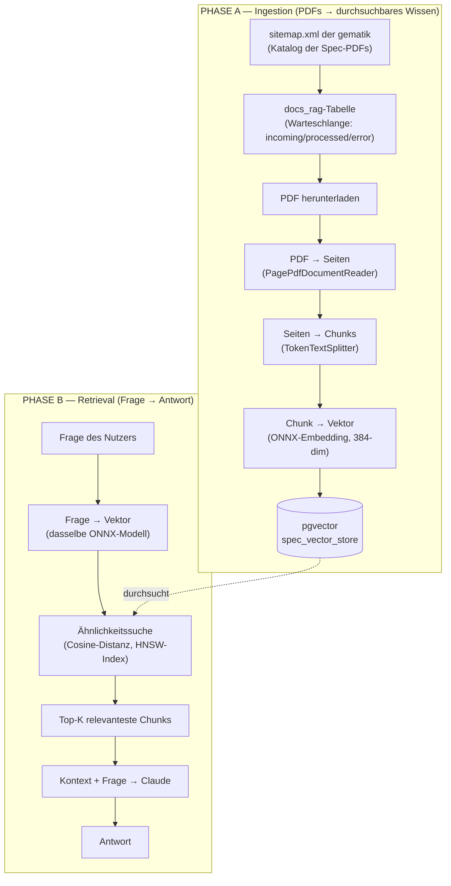
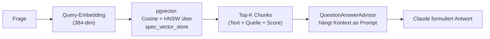

# How RAG works via pgvector — die Suche in den geladenen PDFs

Diese Datei erklärt **konzeptionell** und **end-to-end**, wie in diesem Projekt aus
PDF-Dateien durchsuchbares Wissen wird und wie eine Frage am Ende genau die
passenden PDF-Stellen findet. Es geht um die **komplette Pipeline**: vom Einlesen
der PDFs bis zur Antwort.

> **Kurzfassung (TL;DR):** Eine PDF wird in kleine Text-Häppchen („Chunks")
> zerschnitten. Jeder Chunk wird von einem Embedding-Modell in einen Zahlenvektor
> übersetzt, der seine *Bedeutung* repräsentiert. Diese Vektoren liegen in
> PostgreSQL (Erweiterung **pgvector**). Eine Frage wird mit *demselben* Modell in
> einen Vektor übersetzt; pgvector findet dann die Chunks, deren Vektoren dem
> Frage-Vektor am nächsten liegen — das sind inhaltlich die relevantesten Stellen.
> Diese Stellen gehen als Kontext an Claude, das daraus die Antwort formuliert.

---

## 0. Wichtige Vorklärung: Wo liegen die PDFs überhaupt?

Im Repo gibt es **zwei getrennte pgvector-Welten**. Nur eine davon hat mit PDFs zu
tun — das ist hier entscheidend, um Verwechslungen zu vermeiden:

| | Feature 17 „pgvector"-Demo | **Feature 18 „docs-rag"** *(dieses Dokument)* |
|---|---|---|
| Inhalt | manuell per POST eingegebener Text | **echte gematik-Spec-PDFs** |
| aktiv unter Profil | `postgres` | **`specs`** |
| Embedding-Modell | `HashingEmbeddingModel` (Platzhalter, 256-dim) | **echtes ONNX-Modell** (multilingual, 384-dim) |
| pgvector-Tabelle | `vector_store` | **`spec_vector_store`** |
| Suche über die PDFs | — (keine PDFs) | **ja** |

Die **PDF-Verarbeitung passiert ausschließlich im Profil `specs`** (Feature 18).
Gestartet wird das mit:

```bash
mvn spring-boot:run -Dspring-boot.run.profiles=specs
```

Ein zweiter, wichtiger Punkt: **Feature 18 selbst hat keinen Such-Endpunkt.** Es
*befüllt* nur den Vektorspeicher. Die eigentliche **Suche** läuft über den
RAG-Endpunkt aus **Feature 7** (`/api/rag`, `/api/rag/sources`) — denn unter dem
`specs`-Profil ist der dort verwendete `VectorStore` genau die pgvector-Tabelle
`spec_vector_store` mit den PDF-Chunks. (Mehr dazu in Phase B.)

---

## 1. Das Gesamtbild

Die Pipeline besteht aus zwei Phasen, die zeitlich getrennt ablaufen:



Der rote Faden: **In beiden Phasen wird Text mit demselben Embedding-Modell in
denselben Vektorraum übersetzt.** Nur deshalb ist eine Frage mit den PDF-Chunks
überhaupt vergleichbar.

---

## 2. Was ist ein Embedding? (das Herzstück)

Ein **Embedding** ist eine Liste von Zahlen (hier: 384 Stück, ein „384-dimensionaler
Vektor"), die die *Bedeutung* eines Textstücks codiert. Man kann sich das wie eine
**Koordinate in einem riesigen Bedeutungsraum** vorstellen:

- Texte mit **ähnlicher Bedeutung** bekommen **nahe beieinanderliegende** Koordinaten —
  auch wenn sie völlig andere Wörter benutzen.
- „Wozu dient der Heilberufsausweis?" und ein PDF-Absatz über „HBA: Authentifizierung
  von Ärzten…" landen nah beieinander, obwohl kaum ein Wort übereinstimmt.

Das ist der Unterschied zur klassischen Stichwortsuche: Gesucht wird nach **Bedeutung
(semantisch)**, nicht nach exakten Wörtern.

> Das Modell hier ist `paraphrase-multilingual-MiniLM-L12-v2` (als quantisierte
> ONNX-Datei, ~113 MB, beim ersten Start einmalig geladen und lokal gecacht). Es ist
> bewusst **multilingual** gewählt, weil die gematik-Specs deutscher Fachtext sind —
> das englisch-zentrierte Standardmodell träfe den schlecht. „Lokal/in-process"
> heißt: Das Embedding läuft in der JVM, ohne Cloud-Aufruf und ohne API-Key.

---

## 3. PHASE A — Ingestion: aus PDFs wird durchsuchbares Wissen

### 3.1 Katalog aufbauen (welche PDFs gibt es?)

`CatalogService` lädt die **`sitemap.xml`** des gematik-Spec-Portals. `SpecCatalog`
leitet daraus die einzelnen Spec-PDFs ab (Name, Version, Download-URL) und filtert auf
*versionierte* Dokumente (Entwürfe/Aliasse fallen heraus). Jeder neue Treffer wird als
eine Zeile mit `status = 'incoming'` in die Tabelle **`docs_rag`** geschrieben —
eine **Warteschlange** zu verarbeitender PDFs. Das Seeden ist **idempotent**:
schon bekannte (spec, version) werden übersprungen, nichts geht verloren.

```
sitemap.xml  ──►  SpecCatalog.parse()  ──►  docs_rag (status='incoming')
```

### 3.2 Worker arbeitet die Warteschlange ab

`DocsRagWorker` ist ein Hintergrund-Job (`@Scheduled`), der — solange er „läuft" —
pro Takt bis zu *Batchgröße* (1/5/10) `incoming`-Zeilen zieht und je Dokument:

1. das **PDF live herunterlädt** (von der Download-URL),
2. es über den `SpecPdfProcessor` verarbeitet (siehe 3.3),
3. den Status auf `processed` setzt (samt Chunk-Anzahl) — oder bei Fehlern (z. B.
   404) auf `error` mit Fehlermeldung.

Sind keine `incoming`-Zeilen mehr da, **pausiert** der Worker von selbst. Gesteuert
wird das über die UI bzw. `DocsRagController` (`/seed`, `/start`, `/stop`, `/stats`).
Die vier Zähler (`incoming`/`processed`/`error`/`total`) sind simple
`GROUP BY status`-Abfragen — daraus speist sich der Fortschrittsbalken im Browser.

### 3.3 Der eigentliche Ingestion-Schritt (PDF → Vektoren)

Das ist der Kern. `SpecPdfProcessor.process(...)` macht vier Dinge:

```
PDF ──►  [1] PagePdfDocumentReader ──►  eine Liste „Seiten"-Dokumente
     ──►  [2] TokenTextSplitter      ──►  kleinere „Chunks" (token-basiert)
     ──►  [3] Metadaten anreichern   ──►  spec, version, source je Chunk
     ──►  [4] vectorStore.add(...)   ──►  Embedding + Speicherung in pgvector
```

- **[1] PDF → Seiten:** Der `PagePdfDocumentReader` (PDFBox) extrahiert den Text und
  liefert pro Seite ein `Document`.
- **[2] Seiten → Chunks:** Eine ganze Seite ist als Sucheinheit zu groß und zu
  unspezifisch. Der `TokenTextSplitter` zerschneidet sie in **kleinere, token-große
  Häppchen**. Kleinere Chunks → präzisere Treffer (die Suche liefert genau den
  relevanten Absatz statt der ganzen Seite).
- **[3] Metadaten:** Jeder Chunk erhält `spec`, `version` und `source` (z. B.
  `gemSpec_X_V1.2.0.pdf`). So weiß man später bei jedem Treffer, **aus welchem
  Dokument** er stammt (Quellenangabe, Filterbarkeit).
- **[4] `vectorStore.add(...)`:** Hier passiert das Entscheidende *automatisch*: Für
  jeden Chunk wird das **Embedding berechnet** (ONNX-Modell, 384 Zahlen) und der
  Chunk **zusammen mit seinem Vektor und den Metadaten** in die pgvector-Tabelle
  `spec_vector_store` geschrieben.

Danach ist das PDF „im System": als Menge kleiner, mit Bedeutungs-Koordinaten
versehener Textstücke.

---

## 4. PHASE B — Retrieval: die eigentliche „Suche in den PDFs"

Jetzt zur Frage, die du eigentlich gestellt hast: **Wie funktioniert die Suche?**

Wenn eine Frage kommt (`GET /api/rag?question=…`), läuft konzeptionell Folgendes:

1. **Frage → Vektor:** Die Frage wird mit **demselben** ONNX-Modell in einen
   384-dim-Vektor übersetzt. (Gleicher Vektorraum wie die Chunks — Grundvoraussetzung
   für den Vergleich.)
2. **Ähnlichkeitssuche in pgvector:** pgvector vergleicht den Frage-Vektor mit allen
   Chunk-Vektoren in `spec_vector_store` und berechnet pro Chunk eine **Distanz**.
   Hier wird **Cosine-Distanz** verwendet — anschaulich der „Winkel" zwischen zwei
   Vektoren: kleiner Winkel = inhaltlich ähnlich. Damit das auch bei vielen
   tausend Chunks schnell bleibt, nutzt pgvector einen **HNSW-Index** (ein Index, der
   die *ungefähr* nächsten Nachbarn sehr schnell findet, statt stur alles zu
   vergleichen).
3. **Top-K Treffer:** Zurück kommen die **K** (z. B. die 2–4) ähnlichsten Chunks —
   genau die PDF-Stellen, die zur Frage am besten passen, jeweils mit Score und
   Quelle.
4. **Kontext + Frage → Claude:** Der `QuestionAnswerAdvisor` (Feature 7) hängt diese
   Chunks als **Kontext** an den Prompt: *„Beantworte die Frage; hier ist relevantes
   Wissen: …"*. Claude antwortet **auf Basis der echten PDF-Inhalte** — das ist der
   Sinn von RAG (*Retrieval Augmented Generation*): weniger Halluzination, belegbare,
   aktuelle Antworten.



### Zwei Sichten auf dieselbe Suche

- **`GET /api/rag/sources?question=…&topK=N`** → zeigt **nur das Retrieval**: welche
  Chunks die Suche liefert, samt Score und Quell-PDF. **Ohne LLM/API-Key** — ideal,
  um zu verstehen/debuggen, *warum* eine Antwort so ausfällt („Was hat die Suche
  gefunden?").
- **`GET /api/rag?question=…`** → die **vollständige RAG-Antwort**: Suche **plus**
  Claude, der aus den gefundenen Chunks die finale Antwort formuliert.

> Hinweis: Unter `specs` ist der vorbefüllte In-Memory-Speicher (Telematik-Begriffe
> aus Feature 7) **nicht** aktiv — der einzige `VectorStore` ist die pgvector-Tabelle
> mit den PDF-Chunks. Deshalb durchsucht `/api/rag` in diesem Profil tatsächlich die
> PDFs.

---

## 5. Die Rolle von pgvector konkret

pgvector ist die PostgreSQL-Erweiterung, die das alles möglich macht:

- **Speicherung:** Sie führt einen Vektor-Spaltentyp ein. Jeder Chunk ist eine Zeile
  in `spec_vector_store` mit Text, Metadaten **und** seinem 384-dim-Vektor.
- **Suche:** Sie kann „den Zeilen mit den ähnlichsten Vektoren" direkt in der
  Datenbank finden — Spring AI übersetzt `similaritySearch(...)` in die passende
  SQL-Abfrage; pgvector liefert sortiert nach Distanz zurück.
- **Index (HNSW):** beschleunigt diese Nachbarschaftssuche enorm.
- **Distanzmaß (Cosine):** definiert, was „ähnlich" bedeutet.
- **Metadaten-Filter:** Eine Ähnlichkeitssuche lässt sich mit einem Filter auf
  Metadaten kombinieren (z. B. nur eine bestimmte `spec`/`version`) — pgvector wertet
  den Filter **in der Datenbank** aus.
- **Persistenz:** Einmal verarbeitete PDFs bleiben gespeichert und **überleben einen
  Neustart** — die Ingestion muss nicht wiederholt werden.

### Warum eine eigene Tabelle und exakt 384 Dimensionen?

pgvector erzwingt **eine feste Vektor-Dimension pro Tabelle**. Das ONNX-Modell liefert
384-dim-Vektoren, also ist `spec_vector_store` auf 384 festgelegt. Die Feature-17-Demo
nutzt das 256-dim-Platzhaltermodell und braucht deshalb eine **eigene** Tabelle
(`vector_store`). Würde man beides mischen, wäre die Suche entweder unmöglich (andere
Dimension) oder bedeutungslos (anderer Vektorraum). Merksatz:

> **Embedding-Modell, Vektor-Dimension und Tabelle müssen zusammenpassen — und für
> Ingestion und Suche muss dasselbe Modell verwendet werden.**

---

## 6. Endpunkte & Schnellstart (Profil `specs`)

```bash
# 1) App mit echtem Embedding + pgvector starten (braucht laufende Docker-Engine)
mvn spring-boot:run -Dspring-boot.run.profiles=specs

# 2) Katalog aus der gematik-Sitemap seeden (füllt docs_rag mit 'incoming')
curl -X POST "localhost:8080/api/docs-rag/seed"

# 3) Ingestion-Worker starten (Batchgröße 5) und Fortschritt pollen
curl -X POST "localhost:8080/api/docs-rag/start?batch=5"
curl "localhost:8080/api/docs-rag/stats"

# 4) NUR die Suche ansehen — welche PDF-Chunks passen zur Frage? (ohne LLM)
curl -G "localhost:8080/api/rag/sources" \
     --data-urlencode "question=Wozu dient der Heilberufsausweis?" \
     --data-urlencode "topK=3"

# 5) Vollständige RAG-Antwort (Suche + Claude, braucht ANTHROPIC_API_KEY)
curl -G "localhost:8080/api/rag" \
     --data-urlencode "question=Wozu dient der Heilberufsausweis?"
```

| Endpunkt | Phase | Zweck |
|---|---|---|
| `POST /api/docs-rag/seed` | A | Katalog aus Sitemap in `docs_rag` laden |
| `POST /api/docs-rag/start?batch=N` | A | Ingestion-Worker starten |
| `POST /api/docs-rag/stop` | A | Worker pausieren |
| `GET /api/docs-rag/stats` | A | Fortschrittszähler |
| `GET /api/rag/sources?question=…` | B | **reine Suche** (Chunks + Score + Quelle), ohne LLM |
| `GET /api/rag?question=…` | B | **vollständige RAG-Antwort** (Suche + Claude) |

---

## 7. In einem Satz

Aus PDFs werden token-große Text-Chunks, die ein multilinguales ONNX-Modell in
384-dim-Bedeutungsvektoren übersetzt und pgvector dauerhaft speichert; eine Frage wird
mit demselben Modell in einen Vektor übersetzt, pgvector findet per Cosine-Distanz
(beschleunigt durch HNSW) die ähnlichsten Chunks, und Claude formuliert daraus eine
belegbare Antwort.
