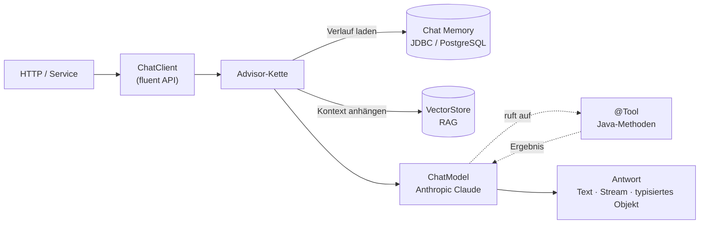
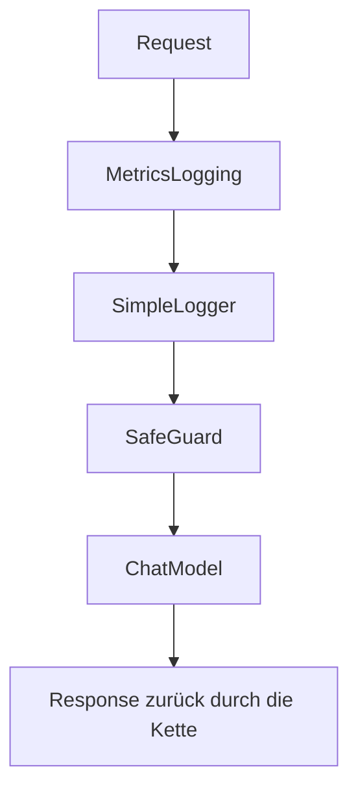

# Spring AI

## KI-Features für Spring-Boot-Anwendungen — pragmatisch & idiomatisch

<div class="pt-8 opacity-80 text-sm">
Backend Working Group · Live-Demo am Code
</div>

<div class="abs-br m-6 flex gap-2 text-xs">
  <span class="px-2 py-1 rounded bg-white/15 text-white backdrop-blur">Spring Boot 4.0.6</span>
  <span class="px-2 py-1 rounded bg-white/15 text-white backdrop-blur">Spring AI 2.0.0-M8</span>
  <span class="px-2 py-1 rounded bg-white/15 text-white backdrop-blur">Java 21</span>
  <span class="px-2 py-1 rounded bg-white/15 text-white backdrop-blur">Anthropic Claude</span>
</div>

<style>
.slidev-layout.cover {
  background: linear-gradient(125deg, #0d1b2a 0%, #1b3a2f 55%, #1f6f43 100%) !important;
  background-image: linear-gradient(125deg, #0d1b2a 0%, #1b3a2f 55%, #1f6f43 100%) !important;
}
.slidev-layout.cover h1 { color: #ffffff; }
.slidev-layout.cover h2 { color: #d6f5e3; font-weight: 400; }
.slidev-layout.cover p { color: #c3d3df; }
</style>

<!--
Sprechernotiz: Ziel ist nicht „noch ein KI-Framework", sondern zu zeigen, wie sich
KI mit den vertrauten Spring-Mitteln (DI, Beans, Autoconfiguration, Tests) bauen lässt.
Jede Folie hat unten rechts den Dateipfad — von hier direkt nach IntelliJ springen.
-->

---
layout: two-cols-header
layoutClass: gap-8
---

# Was ist Spring AI?

::left::

Eine **Spring-idiomatische Abstraktion** über LLM-Provider — kein Bruch mit dem gewohnten Programmiermodell.

- 🧩 **Provider-agnostisch** — derselbe Code für Anthropic, OpenAI, Ollama …
- ⚙️ **Auto-Configuration** — Starter rein, `ChatClient.Builder` wird injiziert
- 🧠 **Bausteine** — Prompt Templates, Structured Output, Tools, RAG, Memory, Advisors
- 🍃 **Spring durch & durch** — Beans, DI, `@RestController`, Tests, CI

::right::

```java
// Starter genügt – Spring AI konfiguriert
// einen ChatClient.Builder als Bean.
@RestController
class HelloAi {
  private final ChatClient chat;

  HelloAi(ChatClient.Builder builder) {
    this.chat = builder.build();
  }

  @GetMapping("/hello")
  String hello() {
    return chat.prompt()
        .user("Sag Hallo auf Deutsch.")
        .call()
        .content();
  }
}
```

<div class="mt-3 text-xs opacity-70">
Das ist das gesamte Setup — keine SDK-Verdrahtung, kein Boilerplate.
</div>

---
layout: default
---

# Architektur — ein Modell, viele Bausteine

Alles läuft über den **ChatClient**. Querschnitts-Logik steckt in der **Advisor-Kette**, der Provider ist austauschbar.



<div class="mt-2 text-xs opacity-70 grid grid-cols-2 gap-x-8">
<div>📦 Ein Feature = ein Package: <code>com.example.springai.demo.featureNN_*</code></div>
<div>🔗 Heutiger Fokus: ChatClient · Prompt Templates · Structured Output · Tools · RAG · Memory</div>
</div>

---
layout: two-cols-header
layoutClass: gap-8
---

# 1 · ChatClient — die zentrale API

::left::

Das Herzstück: Prompt zusammenbauen → ausführen → Antwort lesen.

- **Fluent**: `prompt()` → `user()` → `call()` → `content()`
- **Provider-Abstraktion** — Anthropic heute, OpenAI/Ollama ohne Code-Änderung
- Builder ist **autokonfiguriert** mit dem aktiven `ChatModel`
- `defaultSystem(...)` setzt **Standardverhalten** für alle Anfragen

<div class="mt-4 text-xs opacity-70">
📁 <code>feature01_chatclient/ChatClientController.java</code><br/>
🔗 <code>GET /api/chat?message=…</code>
</div>

::right::

```java {2-5,9-12}
public ChatClientController(ChatClient.Builder builder) {
  this.chatClient = builder
      .defaultSystem("Du bist ein hilfreicher "
          + "Assistent, antworte knapp auf Deutsch.")
      .build();
}

@GetMapping("/api/chat")
public String chat(@RequestParam String message) {
  return chatClient.prompt()
      .user(message)
      .call()        // synchron ausführen
      .content();    // reiner Antworttext
}
```

---
layout: two-cols-header
layoutClass: gap-8
---

# 2 · Prompt Templates — Vorlage statt String-Klebe

::left::

Prompts haben variable Anteile. `PromptTemplate` trennt **Vorlage** und **Werte** sauber.

- Platzhalter `{topic}` statt String-Verkettung
- Werte erst bei `render(Map)` eingesetzt
- Lesbarer, testbar, **weniger Prompt-Injection**
- Templates können auch aus Ressourcen-Dateien kommen

<div class="mt-4 text-xs opacity-70">
📁 <code>feature03_prompttemplate/PromptTemplateController.java</code><br/>
🔗 <code>GET /api/joke?topic=Katzen&language=Englisch</code>
</div>

::right::

```java {1-3,5-7,9-12}
PromptTemplate template = new PromptTemplate(
    "Erzaehle einen Witz ueber {topic}. "
    + "Antworte ausschliesslich auf {language}.");

String prompt = template.render(Map.of(
    "topic", topic,
    "language", language));

return chatClient.prompt()
    .user(prompt)
    .call()
    .content();
```

---
layout: two-cols-header
layoutClass: gap-8
---

# 3 · Structured Output — vom Freitext zum Java-Typ

::left::

`.entity(Class)` weist das Modell an, **JSON im Schema deines Records** zu liefern — und parst es direkt.

- Schema wird aus **Record + Enums** abgeleitet
- Enums erzwingen ein **geschlossenes Werteset**
- Killer-Use-Case: **unstrukturierten Input strukturieren** (Ticket → Kategorie/Priorität/Sentiment)
- Ergebnis ist typsicher → direkt in Routing/SQL nutzbar

<div class="mt-4 text-xs opacity-70">
📁 <code>feature04_structured/StructuredOutputController.java</code><br/>
🔗 <code>GET /api/recipe</code> · <code>POST /api/tickets/analyze</code>
</div>

::right::

```java {1,4-8}
record Recipe(String title, List<String> ingredients,
              List<String> steps) {}

return chatClient.prompt()
    .user("Erstelle ein Rezept fuer: " + dish)
    .call()
    .entity(Recipe.class);  // JSON-Schema +
                            // automatisches Parsing
```

```java {1-2}
enum Category { BUG, FEATURE_REQUEST, BILLING, OTHER }
record TicketAnalysis(Category category,
    Priority priority, Sentiment sentiment, String summary) {}
```

---
layout: two-cols-header
layoutClass: gap-8
---

# 4 · Tool Calling — das Modell ruft deinen Code

::left::

Das Modell darf während der Antwort **eigene Java-Methoden** aufrufen (aktuelle Daten, DB, APIs).

- `@Tool` / `@ToolParam` mit Beschreibungen
- Tool ist eine **dünne Fassade vor Geschäftslogik**
- Als Spring-Bean → **DI auf Services/Repositories**
- Modell **wählt selbst**, welches Tool (falls überhaupt)

<div class="mt-4 text-xs opacity-70">
📁 <code>feature06_tools/ProductTools.java</code> · <code>ToolCallingController.java</code><br/>
🔗 <code>GET /api/tools?message=Wie viele Monitore sind auf Lager?</code>
</div>

::right::

```java {1,3-6}
@Component
class ProductTools {
  @Tool(description = "Liefert den Lagerbestand "
      + "eines Produkts anhand seines Namens.")
  String getProductStock(
      @ToolParam(description="Produktname") String name) {
    return catalog.stockFor(name)...;
  }
}
```

```java {2}
chatClient.prompt().user(message)
    .tools(productTools, new DateTimeTools())
    .call().content();
```

---
layout: two-cols-header
layoutClass: gap-8
---

# 5 · RAG — Antworten auf eigenem Wissen

::left::

Der `QuestionAnswerAdvisor` sucht passende Dokumente im **VectorStore** und hängt sie als Kontext an den Prompt.

- Ähnlichkeitssuche über **Embeddings** (Kosinus)
- Reduziert **Halluzinationen**, hält Wissen aktuell
- Als **Default-Advisor** → jede Anfrage wird angereichert
- `/api/rag/sources` zeigt den Kontext (ohne LLM-Call)

<div class="mt-4 text-xs opacity-70">
📁 <code>feature07_rag/RagController.java</code> · <code>config/DemoBeans.java</code><br/>
🔗 <code>GET /api/rag?question=…</code> · <code>GET /api/rag/sources</code>
</div>

::right::

```java {3-5}
public RagController(ChatClient.Builder builder,
                     VectorStore vectorStore) {
  this.chatClient = builder
      .defaultAdvisors(
          QuestionAnswerAdvisor.builder(vectorStore).build())
      .build();
}
```

```java {2-3}
// Vorbefüllen in DemoBeans:
SimpleVectorStore.builder(embeddingModel).build()
    .add(KnowledgeLoader.loadParagraphs(faq));
```

---
layout: two-cols-header
layoutClass: gap-8
---

# 6 · Chat Memory — Gespräch mit Gedächtnis

::left::

Ein LLM ist **zustandslos**. Der `MessageChatMemoryAdvisor` lädt den Verlauf je **Konversations-ID** und hängt ihn an.

- Verlauf getrennt pro `conversationId`
- `MessageWindowChatMemory` = gleitendes Fenster (N Nachrichten)
- **JDBC-Repository** → überlebt einen Neustart (PostgreSQL)
- Repository austauschbar (H2 in Tests) — **Code bleibt gleich**

<div class="mt-4 text-xs opacity-70">
📁 <code>feature05_memory/ChatMemoryController.java</code> · <code>config/DemoBeans.java</code><br/>
🔗 <code>POST /api/memory/{conversationId}?message=…</code>
</div>

::right::

```java {3-4}
public ChatMemoryController(ChatClient.Builder b,
                            ChatMemory chatMemory) {
  this.chatClient = b.defaultAdvisors(
      MessageChatMemoryAdvisor.builder(chatMemory).build())
    .build();
}
```

```java {3}
chatClient.prompt().user(message)
    .advisors(a -> a.param(
        ChatMemory.CONVERSATION_ID, conversationId))
    .call().content();
```

---
layout: two-cols-header
layoutClass: gap-8
---

# 7 · pgvector — persistenter VectorStore

::left::

Derselbe `VectorStore` wie in RAG — aber in **PostgreSQL** statt im RAM. Nur die Bean wechselt, der Code bleibt.

- `SimpleVectorStore` → `PgVectorStore` per **Profil** `pgvector`
- Embeddings **überleben einen Neustart** (Tabelle `vector_store`)
- **Metadaten-Filter** in der Suche — DB-seitig ausgewertet
- Tests bleiben offline auf **H2** (`@ActiveProfiles("test")`)

<div class="mt-4 text-xs opacity-70">
📁 <code>feature17_pgvector/PgVectorController.java</code> · <code>config/DemoBeans.java</code><br/>
🔗 <code>POST /api/pgvector/documents</code> · <code>GET /api/pgvector/search?query=…&category=…</code>
</div>

::right::

```java {2}
@Bean
@Profile("!pgvector")        // weicht zur Laufzeit dem PgVectorStore
VectorStore vectorStore(EmbeddingModel m) { … }
```

```java {4}
vectorStore.similaritySearch(
    SearchRequest.builder().query(q).topK(3)
        // DB-seitiger Metadaten-Filter:
        .filterExpression("category == 'spring'").build());
```

---
layout: two-cols-header
layoutClass: gap-8
---

# Querschnitt: Advisors — der Erweiterungspunkt

::left::

Memory und RAG sind **selbst Advisors**. Die Kette umschließt jeden Call — ideal für Querschnittsbelange.

- **Interceptor-Muster** um Request/Response
- Eingebaut: `QuestionAnswerAdvisor`, `MessageChatMemoryAdvisor`, `SafeGuardAdvisor`, `SimpleLoggerAdvisor`
- **Eigene** Advisors: Metriken, Logging, Guardrails
- Frei kombinierbar via `defaultAdvisors(...)`

<div class="mt-4 text-xs opacity-70">
📁 <code>feature10_advisors/MetricsLoggingAdvisor.java</code> · <code>AdvisorController.java</code><br/>
🔗 <code>GET /api/advisors?message=…</code>
</div>

::right::



```java
builder.defaultAdvisors(
    new MetricsLoggingAdvisor(),
    new SimpleLoggerAdvisor(),
    SafeGuardAdvisor.builder()
        .sensitiveWords(List.of("passwort")).build());
```

---
layout: two-cols-header
layoutClass: gap-8
---

# Live-Demo — am Projekt ausprobieren

::left::

**Starten** (PostgreSQL via Docker Compose automatisch):

```bash
export ANTHROPIC_API_KEY=sk-...
./mvnw spring-boot:run
```

**Demo-Console** im Browser:

```
http://localhost:8080
```

<div class="mt-3 text-xs opacity-70">
📁 <code>src/main/resources/static/index.html</code><br/>
Visualisiert Structured Output, Tool Calling & RAG-Quellen.
</div>

::right::

```bash
# 1 · ChatClient
curl "localhost:8080/api/chat?message=Erklaere+Spring+AI"

# 3 · Structured Output (Ticket → Typ)
curl -X POST localhost:8080/api/tickets/analyze \
  -d "App stuerzt beim Login ab, sehr aergerlich!"

# 4 · Tool Calling
curl "localhost:8080/api/tools?message=Monitore+auf+Lager?"

# 5 · RAG – Kontext ohne API-Key
curl "localhost:8080/api/rag/sources?question=Was+ist+RAG"
```

<div class="mt-2 text-xs opacity-70">
Tipp: <code>/api/rag/sources</code> & <code>/api/embeddings/similarity</code> laufen ohne API-Key.
</div>

---
layout: default
class: text-left
---

# Key Takeaways

<div class="grid grid-cols-2 gap-x-10 gap-y-3 mt-4">

<div>

### Warum Spring AI?
- 🍃 **Idiomatisch** — DI, Beans, Autoconfig, Tests, CI wie gewohnt
- 🔌 **Provider-agnostisch** — Modell tauschen ohne Code-Umbau
- 🧱 **Komponierbar** — Tools, RAG, Memory als Advisors kombinieren
- 🚀 **Vom Snippet zur Produktion** — DB-Persistenz, Tests, CI im Repo

</div>

<div>

### Repo-Wegweiser
- 📦 Ein Package je Feature: <code>featureNN_*</code>
- 🧪 Tests laufen **offline** (H2, kein API-Key)
- 📖 <code>README.md</code> — Setup & alle Endpoints
- 🖥️ <code>static/index.html</code> — interaktive Console

</div>

</div>

<div class="abs-br m-6 text-xs opacity-60">
Repository: <code>spring_ai_spring_boot_4_exploring_features</code>
</div>

<div class="mt-8 text-center text-2xl opacity-90">
Fragen? → Wir springen direkt in den Code. 🛠️
</div>
